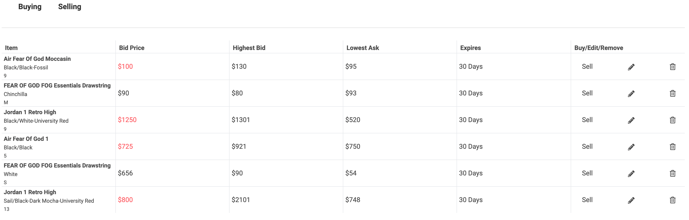

# StreetX
#### A StockX clone built on React/Redux, Ruby on Rails, Python Flask, and hosted on Heroku
### Live Site: https://streetx.herokuapp.com

StreetX is an e-commerce website that acts like a stock exchange. It is inspired by StockX. The current website was built in 2 weeks and new features and improvements will be added in the near future.

User's can view products, place Bids on products they wish to purchase, and place Asks on products they wish to sell. When a Bid and an Ask match, an exchange is completed. Users can search for products through the search bar or browse all pruducts with current prices.


## Key Features
+ Products

    + View all product listings available on the site.
    + Products shown are all real products from StockX.com which have had their details extracted from the StockX database.
+ Listings

    + Create Buy and Sell listings for products you want to purchase or sell.
    + Can view your own listings through your account page.
+ Search
    + Search for products through the search bar by querying the database and matching the parameters through multiple traits
    + The search feature queries the database after every change in the text input and returns matching search results.
+ User Authentication
    + Users can create a new account or log in with an existing one.
    + Passwords are encrypted using BCrypt and appropriate errors are rendered when a login or signup form is filled incorrectly.
+ Fetches live data from the StockX website
    + Uses an Unofficial StockX SDK written by Kelvin Fichter (https://pypi.org/project/stockx-py-sdk/).
    + Python Flask server: http://kevtly.pythonanywhere.com/.

## Technologies
+ React/Redux
    + Frontend is composed of entirely React and Redux to handle changes in views that react to changes in the state of the application. 
    + Redux states are set up to allocate proper state to React components as necessary.
+ Ruby on Rails
    + Backend is managed by Ruby on Rails using a PostgreSQL database.
+ Flask, Pythonanywhere, & Unofficial StockX SDK
    + Flask is a micro web framework written in Python. I chose Flask for my project because it is the most simple Python web framework to use. 
    + I chose Pythonanywhere to host my Flask app because it is also very simple to set up a website which hosts and executes the SDK.
    + I also used PostgreSQL as my database for this web app.

```
The AJAX call I used to send an POST request to my Flask webapp which then makes a POST request to StockX and finally returning back to my StreetX webapp.

export const postStockx = (search) => (
    $.ajax({
        method: 'POST',
        url: 'http://kevtly.pythonanywhere.com/',
        data: {search: search},
    }).then(searchRes => filterSearch(searchRes))
);

//filter & create helper method
const filterSearch = (searchRes) => {  
    for(let i=0; i < searchRes.length; i++) {
        let item = searchRes[i];
        let getRetailPrice = item['searchable_traits'];
        let getImageUrl = item['media']

        let filteredItem = ({
            'title': item['name'],
            'description': item['description'],
            'brand': item['brand'],
            'ticker_symbol': item['ticker_symbol'],
            'release_date': item['release_date'],
            'retail_price': Object.values(getRetailPrice)[2],
            'colorway': item['colorway'],
            'gender': item['gender'],
            'make': item['make'],
            'model': item['model'],
            'object_identifier': item['objectID'],
            'product_category': item['product_category'],
            'highest_bid': item['highest_bid'],
            'last_sale': item['last_sale'],
            'lowest_ask': item['lowest_ask'],
            'sales_last_72': item['sales_last_72'],
            'new_release': item['new_release'],
            'categories': item['categories'],
            'image_url': Object.values(getImageUrl)[2]
        })
        createProduct(filteredItem)
    }
}
```

```
Each button gets passed a callback that changes its parent's state triggering the next form to be displayed

handleSelectSize(size) { 
    return(
        this.setState({ size: size })
    )
}

<div className="grid-tiles">
                {sizes.map((size, i) => (
                    <SizeButton
                    key={i}
                    size={size}
                    handleSelectSize={this.handleSelectSize.bind(this)}/>
                ))}
</div>

```

```
Displays different types of products based on the filter from the URL.

productsMap(products) {
    const category = this.props.match.url.slice(1);
    let selected;
    if (category === 'index') {
      return(
        products.map(product => (
          <ProductIndexItem 
            key={product.id}
            product={product} />
          ))
      )
    } else if (ProductIndex.clothingType.includes(category)) {
      selected = products.filter(product => product.product_category.toLowerCase() === category.toLowerCase())
      return (
        selected.map(product => (
          <ProductIndexItem
          key={product.id}
          product={product}
          />
        ))
      )
    } else {
      selected = products.filter(product =>  product.brand.toLowerCase() === category.toLowerCase() )
      return(
        selected.map(product => (
          <ProductIndexItem
          key={product.id}
          product={product} />
        ))
      )
    }
  }
```
## Future Additions
+ Portfolios which shows a user's complete transaction history.
+ Following Lists which allows users to track specific items and get notifications when prices drop.
+ Data visualization graphs for individual products using D3.
